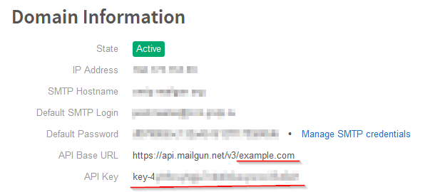

# Logging.ExceptionSender

`ExceptionSenderMiddleware` watches for unhandled exceptions. When found - details are saved to text files in specific folder.

`ExceptionSenderTask` monitors that folder and sends exception info to you by email (using [MailGun.com][3])

Written for **ASP.NET Core** (ASP.NET 5, ASP.NET vNext) projects.

## Main features

* Exception message and stacktrace are captured;
* Last _N_ log records captured ([Logging.Memory][1] is used);
* Captured data saved in `logs` subdirectory for later processing;
* Task (based on [RecurrentTasks][2]) is used for checking new exception data;
* Every single exception - one email to you;
* [MailGun][3] is used to send emails (free quota 10K emails/month), you can add new mail providers (inherit from `MailSenderTask`);
* When new exception is caught - tries to send immediately;
* When message sucessfully sent - files are deleted from disk;
* Can send message to multiple recipients (multiple `To`)

## Installation

Use NuGet package [Logging.ExceptionSender](https://www.nuget.org/packages/Logging.ExceptionSender)

### Dependencies

* Microsoft.AspNetCore.Hosting.Abstractions
* Microsoft.Extensions.Options
* Microsoft.Extensions.PlatformAbstractions
* System.IO.FileSystem
* System.Net.Http
* [Logging.Memory][1]
* [RecurrentTasks][2]


## Usage

### 1. Register at MailGun.com (if needed)

If you wish to use `MailGun` for sending mail, you need to create account (or use existing one, if any).

Register your site at [MailGun.com][3] and write down your domain name and api key:



### 2. Configure/initialize in `Startup.cs`

Sample (minimum) configuration in `config.json` (aka `appsettings.json`):

```json
{
    ...
    "ExceptionSender": {
        "MailgunDomain": "example.com",
        "MailgunApiKey": "key-*************",
        "From": "myapp@example.com",
        "To": ["admin1@example.com", "admin2@example.com"]
    }
    ...
}
```

In `ConfigureServices` method of your `Startup.cs`:

```csharp
services.AddSingleton<ExceptionSenderTask, ExceptionSenderMailgunTask>();
services.Configure<ExceptionSenderOptions>(Configuration.GetSection("ExceptionSender"));
services.Configure<ExceptionSenderMailgunOptions>(Configuration.GetSection("ExceptionSender"));
```

In `Configure` method of your `Statup.cs`:

```csharp
// Enable in-memory logging
loggerFactory.AddMemory();

// Add ExceptionSenderMiddleware into chain (for saving exception info)
app.UseExceptionSender();

// Start background task for sending mail
app.ApplicationServices.GetRequiredService<ExceptionSenderTask>().Start();
```

## Version history

* 2.1.0 (June 28, 2016)
    * Upgrade to ASP.NET Core 1.0.0 RTM
    * `ExceptionSenderTask.LogException` method for explicit exception logging
* 2.0.0 (May 20, 2016)
    * Upgrade to ASP.NET Core RC2
    * Removed `RestSharp` dependency
    * `ExceptionSenderTask` now abstract, you can use (implement) other mail provider instead of MailGun
* 1.0.0 (Feb 8, 2016)
    * Initial release

[1]: https://github.com/iflight/Logging.Memory
[2]: https://github.com/justdmitry/RecurrentTasks
[3]: https://www.mailgun.com
